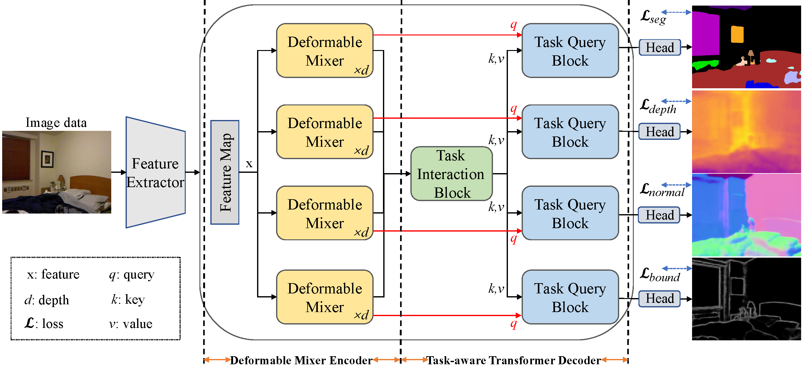

# DeMT

This repo is the official implementation of ["DeMT"](https://arxiv.org/pdf/2103.14030.pdf) as well as the follow-ups. It currently includes code and models for the following tasks:


## Updates

***02/10/2023***


1. Merged Code.

2. Released a series of models. Please look into the [data scaling](https://arxiv.org/abs/2301.03461) paper for more details.

***02/07/2022***

`News`: 

1. The Thirty-Seventh Conference on Artificial Intelligence (AAAI2023) will be held in Washington, DC, USA., from February 7-14, 2023.


***02/01/2022***

1. DeMT got accepted by AAAI 2023. 


## Introduction

**DeMT** (the name `DeMT` stands for **De**formable **M**ixer **T**ransformer for Multi-Task Learning of Dense
Prediction) is initially described in [arxiv](https://arxiv.org/pdf/2301.03461.pdf), which is based on a simple and effective encoder-decoder architecture (i.e., deformable mixer encoder and task-aware transformer decoder). First, the deformable mixer encoder contains two types of operators: the
channel-aware mixing operator leveraged to allow communication among different channels (i.e., efficient channel location mixing), and the spatial-aware deformable operator with deformable convolution applied to efficiently sample more informative spatial locations (i.e., deformed features). Second, the task-aware transformer decoder consists of the task interaction block and task query block. The former is applied to capture task interaction features via self-attention. The latter leverages the deformed features and task-interacted features to generate the corresponding task-specific feature through a query-based Transformer for corresponding task predictions.

DeMT achieves strong performance on PASCAL-Context (`75.33 mIoU semantic segmentation` and `63.11 mIoU Human Segmentation` on test) and
 and NYUD-v2 semantic segmentation (`54.34 mIoU` on test), surpassing previous models by a large margin.



## Main Results on ImageNet with Pretrained Models

**NYUD-v2 dataset DeMT Models**

| model | backbone | #params |FLOPs | SemSeg | Depth | Noemal | boundary| model zoom | config/log |
| :---: | :---: | :---: | :---: | :---: | :---: | :---: | :---: |:---: |:---: |
| DeMT | Swin-T | 32.07M | 100.70G | 46.36 | 0.5871 | 20.60| 76.9 | [Google Drive]()/[config]() | [log]() |
| DeMT | Swin-S | 53.03M | 121.05G | 51.5 | 0.5474 | 20.02 | 78.1 | [Google Drive]()/[config]() | [log]() |
| DeMT | Swin-B | 90.9M | 153.65G | 54.34 | 0.5209 | 19.21 | 78.5 | [Google Drive]()/[config]() | [log]() |


## Citing DeMT multi-task method

```
@inproceedings{xyy2023DeMT,
  title={DeMT: Deformable Mixer Transformer for Multi-Task Learning of Dense Prediction},
  author={Xu, Yangyang and Yang, Yibo and Zhang, Lefei },
  booktitle={Proceedings of the The Thirty-Seventh Conference on Artificial Intelligence (AAAI)},
  year={2023}
}
```


## Getting Started
**Install**

```
conda install pytorch==1.7.0 torchvision==0.8.1 cudatoolkit=10.1 -c pytorch
conda install pytorch-lightning==1.1.8 -c conda-forge
conda install opencv==4.4.0 -c conda-forge
conda install scikit-image==0.17.2
```

**Data Prepare**
```
wget https://data.vision.ee.ethz.ch/brdavid/atrc/NYUDv2.tar.gz
wget https://data.vision.ee.ethz.ch/brdavid/atrc/PASCALContext.tar.gz
tar xfvz ./NYUDv2.tar.gz 
tar xfvz ./PASCALContext.tar.gz
```


**Train**

To train DeMT model:
```
python ./src/main.py --cfg ./config/t-nyud/swin/siwn_t_DeMT.yaml --datamodule.data_dir $DATA_DIR --trainer.gpus 8
```

**Evaluation**

- When the training is finished, the boundary predictions are saved in the following directory: ./logger/NYUD_xxx/version_x/edge_preds/ .
- The evaluation of boundary detection use the MATLAB-based [SEISM](https://github.com/jponttuset/seism) repository to obtain the optimal-dataset-scale-F-measure (odsF) scores.


## Acknowledgement
This repository is based [ATRC](https://github.com/brdav/atrc).

